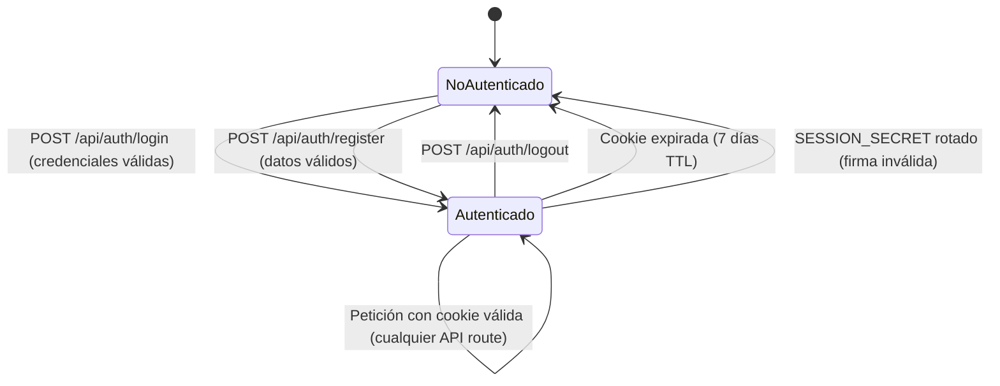
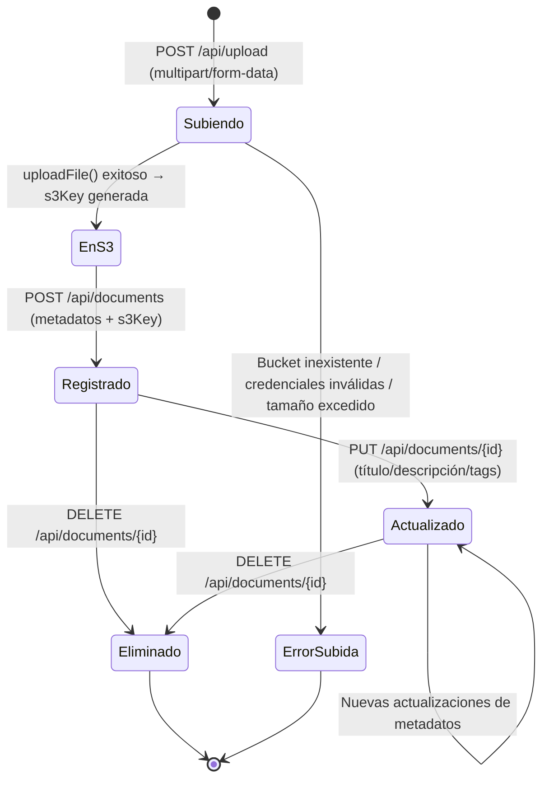

# Web Documents — Microaplicación de Gestión de Documentos

[](https://github.com/Jorgeaapaz/MISEIA_1-1-100-web-documents/actions/workflows/ci-cd.yml)
[](https://gitlab.codecrypto.academy/jorgeaapaz/miseia_1-1-100-web-documents/-/pipelines)
[](https://gitlab.codecrypto.academy/jorgeaapaz/miseia_1-1-100-web-documents/-/pipelines)

Microaplicación **Next.js 16.2.3 (App Router) con TypeScript** de gestión de documentos web que permite a usuarios autenticados subir, organizar, buscar y compartir documentos digitales (PDF, video, audio, imagen) a través de una interfaz moderna, con almacenamiento en S3-compatible (RustFS) y notificaciones por email.

---

## Demo en vivo

**URL de producción:** [https://web-documents.deviaaps.com](https://web-documents.deviaaps.com)

---

## 1. Funcionalidades Implementadas

### 1.1 Autenticación y Sesiones

Registro con validación de email, nombre y contraseña (mínimo 8 caracteres). Las contraseñas se almacenan como hash bcryptjs con 10 salt rounds. Las sesiones utilizan cookies HTTP-only firmadas con HMAC-SHA256 mediante la API `crypto.subtle` nativa de Node.js 18+, con TTL de 7 días. El logout limpia la cookie de sesión y redirige al usuario a la página principal. Se envía email de bienvenida automático al registrarse via Nodemailer + MailHog.

### 1.2 Gestión de Documentos (CRUD completo)

Subida de archivos mediante drag-and-drop con barra de progreso XHR. Soporta PDF, video (mp4/webm/mov/avi), audio (mp3/wav/ogg/flac), imagen (jpg/png/gif/webp/svg) y formatos office (docx/xlsx/pptx) con un límite de 100 MB por archivo. El CRUD completo permite crear, leer, actualizar metadatos (título, descripción, tags) y eliminar documentos; la eliminación borra tanto el registro en MongoDB como el objeto en S3. Búsqueda full-text sobre título, descripción y tags; filtro por tipo de archivo; paginación de 20 ítems/página.

### 1.3 Almacenamiento, Preview y Compartir

Los archivos se almacenan en RustFS (S3-compatible, Docker) en el bucket `ia4devs-storage`. Las descargas se sirven mediante URL prefirmada de S3 con expiración de 1 hora. Preview nativo en el navegador para PDF, video e imagen. Compartir documentos por email: el destinatario recibe un enlace directo con mensaje personalizado.

---

## 2. Estructura del Proyecto

```
1-1-100-web-documents/
├── app/
│   ├── layout.tsx                    # Layout raíz con GlobalProvider, HTML/body
│   ├── page.tsx                      # Landing page con hero y feature cards
│   ├── globals.css                   # Tokens CSS + Tailwind CSS 4
│   ├── (auth)/
│   │   ├── login/page.tsx            # Formulario de inicio de sesión (client)
│   │   └── register/page.tsx         # Formulario de registro (client)
│   ├── documents/
│   │   ├── page.tsx                  # Listado de documentos con SSR + Suspense
│   │   ├── upload/page.tsx           # Página de subida drag-and-drop
│   │   └── [id]/
│   │       ├── page.tsx              # Detalle de documento con preview
│   │       ├── loading.tsx           # Skeleton loader
│   │       └── not-found.tsx         # 404 de documento
│   └── api/
│       ├── auth/login/route.ts       # POST login → cookie HMAC
│       ├── auth/register/route.ts    # POST registro + email bienvenida
│       ├── auth/logout/route.ts      # POST logout → borra cookie
│       ├── auth/me/route.ts          # GET sesión actual → 200 {user|null}
│       ├── documents/route.ts        # GET listado paginado, POST crear
│       ├── documents/[id]/route.ts   # GET, PUT, DELETE por id
│       ├── documents/[id]/download/  # GET → URL prefirmada S3 (1h)
│       ├── upload/route.ts           # POST multipart → S3/RustFS
│       └── mail/route.ts             # POST enviar email via Nodemailer
├── components/
│   ├── ui/
│   │   ├── Button.tsx                # Botón con variantes (primary/secondary/danger)
│   │   ├── Input.tsx                 # Input con label y mensaje de error
│   │   ├── Modal.tsx                 # Diálogo accesible con portal
│   │   ├── Badge.tsx                 # Etiqueta de tipo de archivo con colores
│   │   ├── FileIcon.tsx              # Icono SVG por tipo de archivo
│   │   └── Spinner.tsx               # Spinner de carga accesible
│   ├── layout/
│   │   ├── Header.tsx                # Cabecera sticky con navegación y sesión
│   │   ├── Navbar.tsx                # Links de navegación responsiva
│   │   └── Footer.tsx                # Pie de página
│   └── documents/
│       ├── DocumentCard.tsx          # Tarjeta de documento en listado
│       ├── DocumentList.tsx          # Grid de tarjetas con estado vacío
│       ├── DocumentDetail.tsx        # Vista completa con acciones
│       ├── FilePreview.tsx           # Preview nativo (PDF/video/imagen)
│       ├── UploadZone.tsx            # Zona drag-and-drop + XHR progress
│       ├── SearchBar.tsx             # Búsqueda + filtro por tipo
│       ├── Pagination.tsx            # Controles de paginación
│       └── ShareModal.tsx            # Modal para compartir por email
├── lib/
│   ├── db.ts                         # Singleton MongoClient — nunca crear inline
│   ├── auth.ts                       # HMAC-SHA256, bcrypt, gestión de cookies
│   ├── s3.ts                         # uploadFile, getSignedUrl, deleteFile
│   ├── mail.ts                       # Transporter Nodemailer → MailHog
│   ├── mail-templates.ts             # HTML para bienvenida, confirmación, share
│   ├── types.ts                      # Interfaces TypeScript compartidas
│   └── validators.ts                 # validateEmail, validatePassword, validateFile…
├── context/
│   └── GlobalContext.tsx             # Estado global usuario (Provider + useGlobal)
├── utils/
│   ├── format.ts                     # formatFileSize, formatDate, formatCurrency
│   └── constants.ts                  # APP_NAME, MAX_UPLOAD_SIZE, ALLOWED_EXTENSIONS
├── __tests__/lib/
│   ├── validators.test.ts            # 18 casos unitarios de validadores
│   └── format.test.ts                # 8 casos unitarios de formatters
├── e2e/
│   ├── auth.spec.ts                  # Flujos de registro, login, logout (Playwright)
│   ├── documents.spec.ts             # CRUD, búsqueda, filtros
│   └── upload.spec.ts                # Subida de archivos
├── docs/
│   ├── decisions/                    # ADRs en formato MADR
│   └── compliance/                   # Prompts y reportes de cumplimiento
├── scripts/
│   └── benchmark-query.ts            # Benchmark MongoDB: con/sin índice compuesto
├── Dockerfile                        # Multi-stage: deps → builder → runner (node:24-alpine)
├── docker-compose.app.yml            # Servicio web-documents en miseia-net + Traefik
├── .github/workflows/ci-cd.yml       # GitHub Actions: lint → test → build → deploy
├── .gitlab-ci.yml                    # GitLab CI: lint → test → build + cobertura
├── package.json                      # Dependencias y scripts npm
├── package-lock.json                 # Lockfile — versiones exactas de dependencias
├── jest.config.ts                    # Configuración Jest + ts-jest + umbrales de cobertura
├── playwright.config.ts              # Configuración Playwright E2E
├── next.config.ts                    # output: standalone para imagen Docker
├── tsconfig.json                     # TypeScript strict mode
└── .env.example                      # Plantilla de variables de entorno sin secretos
```

---

## 3. Patrones de Diseño y Arquitectura

| Patrón | Implementación | Propósito |
|--------|---------------|-----------|
| **Singleton** | `lib/db.ts` — `MongoClient` global | Evitar agotamiento del connection pool en hot-reload de Next.js |
| **Service Layer** | `lib/auth.ts`, `lib/s3.ts`, `lib/mail.ts` | Centralizar operaciones de infraestructura fuera de route handlers |
| **Context/Provider** | `context/GlobalContext.tsx` | Estado global del usuario sin prop drilling excesivo |
| **Repository** | Queries tipadas directas en route handlers | Acceso a datos desacoplado de la capa HTTP |
| **Template Method** | `lib/mail-templates.ts` | Builders HTML para cada tipo de email con estructura compartida |
| **Guard Clause** | Validadores en `lib/validators.ts` | Fallar rápido antes de operaciones costosas (S3, MongoDB) |

### 3.1 Dependencias Bloqueadas — Lockfile

El proyecto incluye `package-lock.json` comprometido en el repositorio, garantizando instalaciones completamente reproducibles en todos los entornos: desarrollo local, CI/CD y producción.

```
package-lock.json   ← npm lockfile — fija versiones exactas de toda la cadena de dependencias
```

Instalar siempre con:
```bash
npm ci    # lee el lockfile; falla si hay discrepancias — nunca npm install en CI/CD
```

El `package-lock.json` asegura que la imagen Docker de producción use exactamente las mismas versiones que pasaron las pruebas en el pipeline.

---

## 4. Cómo Funciona

La aplicación sigue el flujo App Router de Next.js 16: los server components obtienen datos directamente de MongoDB mediante el singleton `lib/db.ts`, mientras que los client components (como `UploadZone`) llaman a API routes para operaciones mutables. La sesión del usuario se verifica en cada API route protegida mediante `verifySession()`, que valida la firma HMAC-SHA256 de la cookie HTTP-only sin ninguna consulta a la base de datos.

```typescript
// Flujo completo de subida: app/api/upload/route.ts
export async function POST(request: Request) {
  // 1. Verificar sesión (HMAC — sin DB lookup)
  const session = await verifySession();
  if (!session) return NextResponse.json({ error: "No autenticado" }, { status: 401 });

  // 2. Validar archivo (extensión + tamaño)
  const file = (await request.formData()).get("file") as File;
  const validation = validateFile({ name: file.name, size: file.size });
  if (!validation.valid) return NextResponse.json({ error: validation.error }, { status: 400 });

  // 3. Construir key con aislamiento por usuario
  const s3Key = `documents/${session.userId}/${crypto.randomUUID()}/${file.name}`;

  // 4. Subir a S3/RustFS
  await uploadFile(s3Key, Buffer.from(await file.arrayBuffer()), file.type);

  // 5. El cliente completa metadatos → POST /api/documents → registro en MongoDB
  return NextResponse.json({ s3Key, fileName: file.name, fileSize: file.size });
}
```

---

## 5. Inicio Rápido

### Prerrequisitos

- Node.js 24 LTS
- npm 10+ (incluido con Node.js 24)
- Docker Desktop
- MongoDB instalado localmente (puerto 27017)

### Instalación

```bash
# Clonar el repositorio
git clone https://github.com/Jorgeaapaz/MISEIA_1-1-100-web-documents.git
cd MISEIA_1-1-100-web-documents

# Instalar dependencias con lockfile (reproducible, recomendado)
npm ci

# Configurar variables de entorno
cp .env.example .env.local
# Editar .env.local con tus valores (ver sección Variables de Entorno)
```

### Servicios de soporte (Docker)

```bash
# RustFS — almacenamiento S3-compatible
docker run -d --name rustfs -p 10000:10000 -p 10001:10001 \
  -e RUSTFS_ACCESS_KEY=rustfsadmin \
  -e RUSTFS_SECRET_KEY=RustfsSecret2024! \
  rustfs/rustfs

# Crear el bucket (necesario solo la primera vez)
docker run --rm \
  -e AWS_ACCESS_KEY_ID=rustfsadmin \
  -e AWS_SECRET_ACCESS_KEY=RustfsSecret2024! \
  -e AWS_DEFAULT_REGION=us-east-1 \
  amazon/aws-cli s3 mb s3://ia4devs-storage --endpoint-url http://localhost:10000

# MailHog — servidor SMTP de prueba
docker run -d --name mailhog -p 1025:1025 -p 8025:8025 mailhog/mailhog
```

### Ejecutar en desarrollo

```bash
npm run dev
# → http://localhost:3000
```

### Scripts disponibles

| Comando | Descripción |
|---------|-------------|
| `npm run dev` | Servidor de desarrollo con HMR |
| `npm run build` | Build de producción (ejecutar solo al finalizar) |
| `npm start` | Servidor de producción |
| `npm run lint` | ESLint con reglas Next.js |
| `npm test` | Jest con cobertura |
| `npm run test:ci` | Jest en modo CI (--runInBand, --ci) |
| `npx playwright test` | Pruebas E2E (requiere app corriendo en :3000) |

### Variables de Entorno

```env
SESSION_SECRET=genera-con-openssl-rand-hex-32
MONGODB_URI=mongodb://localhost:27017
MONGODB_DB=web-documents
AWS_USERNAME=rustfsadmin
AWS_PASSWORD=RustfsSecret2024!
AWS_REGION=us-east-1
AWS_URL=http://localhost:10000
AWS_BUCKET=ia4devs-storage
MAILHOG_HOST=localhost
MAIL_PORT=1025
NODE_ENV=development
NEXT_PUBLIC_API_URL=http://localhost:3000
```

---

## 6. Ejemplos de Uso

### Registro de usuario

```bash
# Éxito (201)
curl -c cookies.txt -X POST http://localhost:3000/api/auth/register \
  -H "Content-Type: application/json" \
  -d '{"name":"María García","email":"maria@ejemplo.com","password":"Segura123!"}'
# → {"user":{"_id":"...","name":"María García","email":"maria@ejemplo.com","createdAt":"..."}}

# Error — contraseña muy corta (400)
curl -X POST http://localhost:3000/api/auth/register \
  -H "Content-Type: application/json" \
  -d '{"name":"Test","email":"a@b.com","password":"corta"}'
# → {"error":"La contrasena debe tener al menos 8 caracteres"}
```

### Subida de documento

```bash
# Éxito (200)
curl -b cookies.txt -X POST http://localhost:3000/api/upload \
  -F "file=@informe.pdf;type=application/pdf"
# → {"s3Key":"documents/userId/uuid/informe.pdf","fileName":"informe.pdf","fileSize":204800,"fileType":"pdf"}

# Error — extensión no permitida (400)
curl -b cookies.txt -X POST http://localhost:3000/api/upload \
  -F "file=@programa.exe"
# → {"error":"Tipo de archivo no permitido: .exe"}
```

### Listado con búsqueda y paginación

```bash
curl "http://localhost:3000/api/documents?page=1&limit=20&search=informe&type=pdf"
# → {"data":[{...}],"total":42,"page":1,"limit":20,"totalPages":3}
```

### Verificar sesión actual

```bash
# No autenticado (200 con user:null — sin error de consola)
curl http://localhost:3000/api/auth/me
# → {"user":null}

# Autenticado (200 con datos)
curl -b cookies.txt http://localhost:3000/api/auth/me
# → {"user":{"_id":"...","name":"María García","email":"maria@ejemplo.com"}}
```

---

## 7. Requisitos

### 7.1 Requisitos Funcionales (IEEE 830)

```
FR-001: El usuario no autenticado deberá poder registrarse con nombre, email y contraseña
        de al menos 8 caracteres, de modo que se cree su cuenta y reciba un email de bienvenida.

FR-002: El usuario registrado deberá poder iniciar sesión con email y contraseña correctos,
        de modo que se establezca una cookie de sesión HTTP-only con vigencia de 7 días.

FR-003: El usuario autenticado deberá poder cerrar sesión en cualquier momento,
        de modo que la cookie sea eliminada y sea redirigido a la página principal.

FR-004: El usuario autenticado deberá poder subir un archivo (PDF, video, audio, imagen,
        office) de hasta 100 MB mediante drag-and-drop, de modo que quede almacenado en S3
        y registrado en MongoDB con título, descripción y tags.

FR-005: El usuario autenticado deberá poder listar sus documentos con búsqueda full-text
        por título, descripción y tags, de modo que pueda encontrar documentos relevantes
        en colecciones de hasta 10,000 registros.

FR-006: El usuario autenticado deberá poder filtrar sus documentos por tipo de archivo
        (pdf, video, audio, imagen, otro), de modo que pueda acotar el conjunto de resultados
        a la categoría de interés.

FR-007: El usuario autenticado deberá poder visualizar el detalle de un documento
        incluyendo preview nativo (PDF, video, imagen), de modo que pueda inspeccionar el
        contenido sin descargar el archivo.

FR-008: El usuario autenticado deberá poder descargar cualquiera de sus documentos
        mediante URL prefirmada de S3 con expiración de 1 hora, de modo que la descarga
        sea segura y no exponga credenciales de almacenamiento.

FR-009: El usuario autenticado deberá poder eliminar un documento propio, de modo que
        tanto el registro en MongoDB como el objeto en S3 sean eliminados permanentemente.

FR-010: El usuario autenticado deberá poder compartir un documento por email ingresando
        la dirección del destinatario y un mensaje personalizado, de modo que el destinatario
        reciba un enlace directo al documento en la plataforma.

FR-011: El sistema deberá paginar los resultados de documentos en grupos de 20 ítems/página
        (máximo 100 por petición), de modo que la interfaz mantenga tiempos de carga
        aceptables independientemente del tamaño de la colección.

FR-012: El usuario autenticado deberá poder actualizar el título, descripción y tags de un
        documento existente sin necesidad de volver a subir el archivo.
```

### 7.2 Requisitos No Funcionales

```
NFR-PERF-001: La API de listado de documentos debe responder en < 200ms (p95) con hasta
              1,000 documentos por usuario, con índice compuesto {uploadedBy:1, createdAt:-1}.

NFR-PERF-002: La subida de archivos de hasta 10 MB debe completarse en < 5 segundos en
              una conexión de 10 Mbps bajo condiciones normales de red.

NFR-SEC-001:  Las contraseñas deben almacenarse como hash bcryptjs con cost factor ≥ 10;
              nunca se almacena ni transmite la contraseña en texto plano.

NFR-SEC-002:  Todas las cookies de sesión deben configurarse con HttpOnly=true, SameSite=Lax
              y Secure=true en producción, para prevenir ataques XSS y CSRF.

NFR-SEC-003:  El SESSION_SECRET debe tener entropía mínima de 256 bits (32 bytes hex)
              generados criptográficamente (openssl rand -hex 32).

NFR-SCAL-001: La arquitectura stateless (sesión en cookie firmada, sin sesiones en BD)
              debe permitir escalar horizontalmente a N réplicas sin cambios de código.

NFR-USAB-001: La interfaz debe ser completamente funcional en pantallas desde 320px de ancho
              (mobile-first), con elementos interactivos de al menos 44×44px (WCAG 2.1 AA).

NFR-AVAIL-001: El servicio debe tener disponibilidad ≥ 99.5% mensual, con reinicio
               automático del contenedor Docker (restart: unless-stopped).

NFR-MAINT-001: La cobertura de pruebas unitarias debe mantenerse ≥ 60% de líneas en código
               de dominio (lib/ + utils/), verificada en cada push por CI/CD.

NFR-OBS-001:  El pipeline CI/CD debe publicar reporte de cobertura (lcov + cobertura XML)
              como artefacto en cada ejecución de la suite de pruebas.

NFR-PERF-003: La imagen Docker de producción no debe superar 500 MB, usando node:24-alpine
              y output standalone de Next.js.
```

### 7.3 Requisitos Regulatorios (México)

```
REG-001 (LFPDPPP): El sistema debe implementar medidas de seguridad técnicas para proteger
         los datos personales de los usuarios (nombre, email) conforme al Artículo 19 de la
         Ley Federal de Protección de Datos Personales en Posesión de los Particulares.
         Implementación: hash bcryptjs, cookies HttpOnly, HTTPS en producción (Traefik + Let's Encrypt).

REG-002 (NOM-151): Los archivos electrónicos con valor legal almacenados deben conservarse
         bajo esquemas que garanticen su integridad e inalterabilidad, conforme a la
         NOM-151-SCFI-2016. Implementación: s3Keys inmutables por UUID; sin sobrescritura de objetos.

REG-003 (MAAGTICSI): Para entidades de la APF que adopten el sistema, el almacenamiento y
         transmisión de documentos deben cumplir los controles del Manual Administrativo de
         Aplicación General en TIC y Seguridad de la Información.
         Implementación: TLS 1.2+ en tránsito (Traefik), cifrado en reposo configurable en S3.
```

### 7.4 Requisitos Operativos

```
OPS-001: El sistema debe desplegarse mediante pipeline CI/CD (GitHub Actions) con verificación
         de health check post-deploy; un fallo en el health check debe activar alerta inmediata.
         Verificación: docker ps --filter status=running | grep web-documents tras el deploy.

OPS-002: RPO < 24 horas — los datos de MongoDB deben respaldarse diariamente con retención
         de 30 días. RTO < 2 horas — el procedimiento de restauración debe estar documentado
         y verificado trimestralmente.

OPS-003: El sistema debe estar disponible 24/7 sin ventanas de mantenimiento programadas
         mayores a 2 horas. El mantenimiento debe anunciarse con 24 horas de anticipación.

OPS-004: Los logs del contenedor deben conservarse mínimo 7 días. Eventos críticos (errores 500
         repetidos, fallos de autenticación en masa) deben generar alerta dentro de 5 minutos.

OPS-005: La imagen Docker de producción debe construirse desde el Dockerfile comprometido
         en el repositorio; está prohibido modificar el contenedor en ejecución. Todos los
         despliegues deben ejecutarse exclusivamente desde el pipeline CI/CD.
```

### 7.5 Atributos de Calidad

#### 7.5.1 Performance: Latencia de API de Listado [PERF-LIST-LATENCY]
**Atributo de calidad:** Performance
**Métrica:** Latencia en milisegundos

**Especificación:**
- Percentil 99: < 500 ms
- Percentil 95: < 200 ms
- Percentil 50: < 80 ms

**Condiciones:**
- Dataset: hasta 1,000 documentos por usuario
- Carga: 50 peticiones concurrentes
- Índice: `{ uploadedBy: 1, createdAt: -1 }` activo en MongoDB

**Excepciones:**
- Primera petición tras arranque en frío del contenedor: < 3 s aceptable
- Búsqueda full-text sin índice de texto dedicado: hasta 800 ms aceptable

**Verificación:** Load test con k6; métricas en Prometheus + Grafana

---

#### 7.5.2 Escalabilidad: Arquitectura sin Estado [SCAL-STATELESS]
**Atributo de calidad:** Escalabilidad
**Métrica:** Número de réplicas soportadas sin degradación

**Especificación:**
- Mínimo: 1 réplica (modo actual de producción)
- Objetivo: 5 réplicas simultáneas sin sesión pegajosa
- Máximo probado: 10 réplicas detrás de Traefik

**Condiciones:**
- Sesión almacenada en cookie firmada (completamente stateless)
- MongoDB y S3 como servicios externos compartidos
- Red Docker `miseia-net` como capa de comunicación interna

**Excepciones:**
- El bucket S3 `ia4devs-storage` debe existir antes de escalar (creación manual única)

**Verificación:** Despliegue de 3 réplicas con `docker service scale`; validar respuestas consistentes entre réplicas

---

#### 7.5.3 Confiabilidad: Reinicio Automático [RELI-AUTO-RESTART]
**Atributo de calidad:** Confiabilidad
**Métrica:** MTTR (Mean Time To Recovery) en segundos

**Especificación:**
- MTTR < 30 segundos ante caída del contenedor
- Política `restart: unless-stopped` en Docker
- Health check post-deploy verificado en pipeline CI/CD

**Condiciones:**
- Orquestación: Docker standalone (no Swarm ni Kubernetes en fase actual)
- MongoDB y RustFS deben estar disponibles en `miseia-net`

**Excepciones:**
- Si MongoDB no responde, el contenedor reinicia pero las API devuelven 500 hasta reconexión

**Verificación:** Matar el contenedor manualmente y medir tiempo hasta `docker ps` muestre `Up`

---

#### 7.5.4 Seguridad: Protección de Sesión [SEC-SESSION]
**Atributo de calidad:** Seguridad
**Métrica:** Superficie de ataque (vectores OWASP Top 10)

**Especificación:**
- Sin secretos en localStorage ni sessionStorage (XSS-safe)
- Cookie `HttpOnly + SameSite=Lax + Secure` en producción
- HMAC-SHA256 con `crypto.subtle` nativo — sin dependencias de firma externas
- SESSION_SECRET de 256 bits mínimo generado criptográficamente

**Condiciones:**
- `NODE_ENV=production` activa flag `Secure` en la cookie
- Rotación de SESSION_SECRET invalida globalmente todas las sesiones activas

**Excepciones:**
- En `NODE_ENV=development` la cookie no requiere HTTPS (flag Secure inactivo)

**Verificación:** OWASP ZAP scan en staging; revisión manual de cabeceras `Set-Cookie`

---

#### 7.5.5 Mantenibilidad: Cobertura de Pruebas [MAINT-COVERAGE]
**Atributo de calidad:** Mantenibilidad
**Métrica:** Porcentaje de líneas cubiertas por pruebas automatizadas

**Especificación:**
- Código de dominio (lib/ + utils/): ≥ 60% líneas y funciones
- Ramas (branches): ≥ 50%
- El pipeline CI/CD falla si no se cumplen los umbrales

**Condiciones:**
- Medida por Jest + ts-jest en cada push a master
- Umbrales en `jest.config.ts` → `coverageThreshold`

**Excepciones:**
- Archivos de tipo definición (`*.d.ts`) y configuración excluidos de cobertura

**Verificación:** `npm run test:ci` — el pipeline falla automáticamente si los umbrales caen

---

### 7.6 Criterios de Aceptación BDD

```gherkin
Feature: Registro de usuario
  Scenario: Registro exitoso con credenciales válidas
    Given el usuario está en la página /register
    And ha ingresado nombre "María García", email "maria@test.com" y contraseña "Segura123!"
    When hace clic en "Crear cuenta"
    Then el sistema crea la cuenta en MongoDB con contraseña hasheada
    And establece una cookie de sesión HTTP-only con TTL de 7 días
    And redirige al usuario a /documents
    And envía un email de bienvenida a "maria@test.com" vía MailHog

Feature: Inicio de sesión fallido
  Scenario: Login con credenciales incorrectas
    Given el usuario está en la página /login
    And ingresa email "noexiste@test.com" y contraseña "cualquiera123"
    When hace clic en "Iniciar sesión"
    Then el sistema muestra el mensaje "Credenciales incorrectas"
    And no establece ninguna cookie de sesión

Feature: Subida de documentos
  Scenario: Subida exitosa de un PDF
    Given el usuario está autenticado y en la página /documents/upload
    When arrastra un archivo "informe.pdf" de 2 MB a la zona de subida
    Then el sistema muestra la barra de progreso durante la transferencia
    And al completarse redirige al formulario de metadatos
    And el documento aparece en la lista de documentos del usuario

Feature: Control de acceso por propietario
  Scenario: Acceso denegado a documento de otro usuario
    Given el usuario "A" está autenticado
    And existe el documento "doc-123" que pertenece al usuario "B"
    When el usuario "A" solicita GET /api/documents/doc-123
    Then el sistema responde con status 403
    And el cuerpo de la respuesta no contiene datos del documento

Feature: Eliminación con limpieza en S3
  Scenario: Eliminar un documento borra su objeto en S3
    Given el usuario autenticado tiene el documento "doc-456" con s3Key conocida
    When hace clic en "Eliminar" y confirma la acción en el modal
    Then el registro es eliminado de la colección "documents" en MongoDB
    And el objeto S3 en la clave correspondiente es eliminado de RustFS
    And el documento ya no aparece en el listado paginado
```

---

## 8. Especificaciones

### 8.1 Especificación Funcional

```
# Spec Funcional: Gestión de Documentos

## Caso de Uso: Subir Documento
Actores: Usuario Autenticado, S3/RustFS, MongoDB

Precondiciones:
- Usuario con sesión válida (cookie HMAC-SHA256 no expirada)
- Bucket ia4devs-storage existente en RustFS
- Archivo dentro de tipos y tamaño permitidos (< 100 MB, extensión en lista blanca)

Flujo principal:
1. Usuario arrastra archivo a UploadZone
2. Cliente valida extensión y tamaño (validateFile — client-side)
3. XHR POST /api/upload con FormData + cabecera de progreso
4. Servidor verifica sesión (verifySession — sin DB lookup)
5. Servidor revalida archivo (validateFile — server-side, doble validación)
6. Servidor construye s3Key: documents/{userId}/{uuid}/{fileName}
7. Servidor llama uploadFile() → PutObjectCommand a RustFS
8. Servidor responde {s3Key, fileName, fileSize, fileType}
9. Cliente presenta formulario de metadatos (título, descripción, tags)
10. POST /api/documents con todos los metadatos + s3Key
11. Servidor inserta en colección "documents" de MongoDB
12. Cliente redirige a /documents/{id}

Criterios de aceptación:
- Dado usuario autenticado con archivo "reporte.pdf" de 5 MB
- Cuando completa el flujo con título "Reporte Q1" y tags ["finanzas","2026"]
- Entonces GET /api/documents devuelve el documento en el listado
- Y el objeto existe en S3 en la clave documents/{userId}/{uuid}/reporte.pdf
- Y el registro en MongoDB contiene s3Key, fileType="pdf", uploadedBy={userId}
```

### 8.2 Especificación Estructural

```
Colecciones MongoDB:

users {
  _id: ObjectId (PK, auto-generado)
  name: string (mín. 2 chars)
  email: string (unique, indexed)
  passwordHash: string (bcryptjs, cost 10)
  createdAt: Date (BSON Date nativo)
  updatedAt: Date (BSON Date nativo)
}

documents {
  _id: ObjectId (PK, auto-generado)
  title: string (1–200 chars)
  description: string (max 2000 chars, opcional)
  fileName: string (nombre original del archivo)
  fileType: "pdf"|"video"|"audio"|"image"|"other"
  fileSize: number (bytes, entero positivo)
  s3Key: string (formato: documents/{userId}/{uuid}/{fileName})
  uploadedBy: ObjectId (referencia a users._id)
  tags: string[] (array de etiquetas libres)
  createdAt: Date
  updatedAt: Date
}

Índices recomendados en producción:
  users.email: { email: 1 }, unique: true
  documents.owner+fecha: { uploadedBy: 1, createdAt: -1 }
  documents.type+fecha:  { type: 1, createdAt: -1 }

S3 / RustFS:
  Bucket: ia4devs-storage
  Organización: documents/{userId}/{uuid}/{fileName}
  Acceso: AWS_USERNAME + AWS_PASSWORD en env vars
  Configuración: forcePathStyle: true (requerido por RustFS en lib/s3.ts)
  URL prefirmadas: expiración 3600 segundos (1 hora)
```

### 8.3 Especificación de Comportamiento (Máquinas de Estado)

**Ciclo de vida de sesión:**


**Ciclo de vida de documento:**


### 8.4 Especificación Operativa

```
# Spec Operativa: Web Documents en GCP

## Despliegue
- Pipeline: GitHub Actions lint → test → build → deploy (solo en push a master)
- Estrategia: docker rm -f + docker run (zero-downtime no garantizado en fase actual)
- Rollback: re-ejecutar el job "deploy" del commit anterior desde GitHub Actions UI
- Smoke test post-deploy: docker ps --filter name=web-documents --filter status=running

## Infraestructura actual
- VM: GCP ubuntu-vm-docker28 (us-south1-c, 34.174.56.186)
- Red: miseia-net (Docker bridge compartida con MongoDB, RustFS, Traefik)
- TLS: Traefik v3.3 con wildcard cert *.deviaaps.com via Cloudflare DNS-01
- Dominio: web-documents.deviaaps.com → Traefik → contenedor :3000

## Monitoreo
- Logs: docker logs web-documents --tail 100 --follow
- Health: curl https://web-documents.deviaaps.com/api/auth/me → 200 {user:null}
- Recursos: docker stats web-documents
- CI/CD: panel GitHub Actions (https://github.com/Jorgeaapaz/MISEIA_1-1-100-web-documents/actions)

## Runbook: Fallo de Upload (500)
1. Verificar que el bucket ia4devs-storage existe en RustFS:
   docker run --rm --network miseia-net \
     -e AWS_ACCESS_KEY_ID=<key> -e AWS_SECRET_ACCESS_KEY=<secret> \
     -e AWS_DEFAULT_REGION=us-east-1 amazon/aws-cli \
     s3 ls --endpoint-url http://rustfs:9000
2. Si no existe, crearlo: s3 mb s3://ia4devs-storage --endpoint-url http://rustfs:9000
3. Verificar que el contenedor rustfs está activo: docker ps | grep rustfs
4. Verificar variables de entorno del contenedor: docker inspect web-documents | grep -A5 Env
5. Si persiste: revisar docker logs web-documents y escalar al equipo de plataforma
```

### 8.5 Invariantes y Contratos

```
CONTRATO: verifySession()

PRECONDICIÓN:
- La cookie "session" puede o no estar presente en la petición HTTP entrante
- SESSION_SECRET debe estar configurado en variables de entorno

POSTCONDICIÓN:
- Devuelve SessionPayload { userId: string, exp: number } si la sesión es válida
- Devuelve null si: cookie ausente, firma HMAC inválida, o payload expirado
- Nunca lanza excepción — captura todos los errores internamente y devuelve null

INVARIANTE:
- Si devuelve payload no-null: payload.exp > Date.now()
- Si devuelve payload no-null: la firma HMAC-SHA256 del data es matemáticamente correcta
- La función es pura respecto al reloj del sistema (no modifica cookies)

EJEMPLOS:
- Cookie válida, no expirada → { userId: "abc123", exp: 1782000000000 }
- Cookie con firma manipulada → null
- Cookie con payload expirado → null
- Sin cookie en la petición → null

---

CONTRATO: uploadFile(key, buffer, contentType)

PRECONDICIÓN:
- key: string no vacío con formato "documents/{userId}/{uuid}/{fileName}"
- buffer: Buffer con contenido del archivo (size > 0)
- contentType: MIME type válido string
- Bucket ia4devs-storage debe existir en RustFS
- Variables AWS_USERNAME, AWS_PASSWORD, AWS_URL, AWS_BUCKET configuradas

POSTCONDICIÓN:
- El objeto queda almacenado en S3/RustFS bajo la key exacta proporcionada
- Lanza error (NoSuchBucket, InvalidSignature, etc.) si las precondiciones de S3 no se cumplen

INVARIANTE:
- La key en S3 es inmutable tras la subida (PutObjectCommand no crea versiones)
- El objeto persiste en S3 hasta que se llame explícitamente deleteFile(key)
- El tamaño del objeto en S3 es igual a buffer.length

EJEMPLOS:
- uploadFile("documents/u1/uuid/doc.pdf", buf, "application/pdf") → undefined (éxito)
- uploadFile("key", buf, "type") con bucket inexistente → throws NoSuchBucket
```

### 8.6 ADRs — Registros de Decisión de Arquitectura

Ver directorio completo: [docs/decisions/](docs/decisions/)

#### ADR-001: MongoDB sobre PostgreSQL

**Estado:** Aceptado

**Contexto:** La aplicación gestiona tipos de archivo heterogéneos (PDF, video, audio, imagen, office), cada uno con posibles metadatos distintos. Un esquema relacional fijo requeriría columnas nulas para todos los posibles campos o tablas EAV con joins complejos.

**Opciones consideradas:**
1. PostgreSQL con columna JSONB — relacional + metadatos flexibles; requiere servicio adicional y migraciones
2. PostgreSQL normalizado (tabla por tipo) — tipado estricto; tablas dispersas y UNIONs complejas
3. **MongoDB con driver nativo** — esquema flexible, sin migraciones; adoptado
4. Mongoose (ORM MongoDB) — validación en ORM; capa de abstracción no necesaria para este proyecto

**Decisión:** MongoDB `mongodb@7.1.1`. Interfaces TypeScript en `lib/types.ts` como contrato de esquema.

**Datos cuantitativos** (benchmark `scripts/benchmark-query.ts`, 1,000 docs, 100 iteraciones):

| Escenario | p50 | p95 | p99 |
|-----------|-----|-----|-----|
| Sin índice (collection scan) | 2 ms | 3 ms | 4 ms |
| Con índice `{type:1, createdAt:-1}` | 2 ms | 2 ms | 3 ms |

**Consecuencias:** Sin migraciones al agregar campos; mapeo directo a JSON; sin foreign keys a nivel de BD.

---

#### ADR-002: RustFS como Almacenamiento S3-Compatible

**Estado:** Aceptado

**Contexto:** Se necesita almacenamiento de binarios grandes (hasta 100 MB) con API S3, sin costos de AWS para un entorno de aprendizaje, ejecutable en Docker y reemplazable por S3 real sin cambios de código.

**Opciones consideradas:**
1. AWS S3 real — producción con costos por petición; no apropiado para aprendizaje
2. MinIO — maduro; más features de las necesarias para este proyecto
3. **RustFS** — ligero, Rust-based, S3-compatible; adoptado
4. Sistema de archivos local — no valida integración con SDK S3

**Decisión:** RustFS en Docker. Único cambio específico: `forcePathStyle: true` en `lib/s3.ts`.

---

#### ADR-003: Cookies HMAC-SHA256 sobre JWT

**Estado:** Aceptado

**Contexto:** Autenticación segura en Next.js sin dependencias de firma externas, con protección XSS/CSRF y capacidad de invalidación global.

**Opciones consideradas:**
1. JWT con `jsonwebtoken` — estándar; añade dependencia para funcionalidad ya en Node.js built-ins
2. NextAuth.js — completo; incompatible con restricción de no usar `middleware.tsx` (AGENTS.md)
3. Sesiones en BD — revocación individual; requiere DB lookup en cada petición autenticada
4. **HMAC-SHA256 con `crypto.subtle`** — sin dependencias externas; adoptado

**Decisión:** Cookie `{base64(payload)}.{HMAC-SHA256}`, TTL 7 días, ~20 líneas en `lib/auth.ts`.

---

#### ADR-004: Next.js App Router con output standalone

**Estado:** Aceptado

**Contexto:** Next.js 16.2.3 ofrece App Router (nuevo) o Pages Router (maduro). La necesidad de una imagen Docker compacta requiere `output: "standalone"` para no incluir `node_modules` completo en la imagen final.

**Decisión:** App Router para SSR directo a MongoDB en server components + `output: "standalone"` en `next.config.ts` para reducir la imagen Docker de ~1 GB a ~150 MB.

**Consecuencias:** APIs con breaking changes respecto a versiones anteriores; documentación oficial solo en `node_modules/next/dist/docs/`.

---

#### ADR-005: Pipelines Duales — GitHub Actions + GitLab CI

**Estado:** Aceptado

**Contexto:** El proyecto requiere CI/CD con deploy automático a GCP VM (GitHub Actions) y pipeline de validación en GitLab (requisito académico del programa MISEIA).

**Decisión:** GitHub Actions para lint → test → build → deploy (master push); GitLab CI para lint → test → build (validación de código sin deploy).

**Consecuencias:** Duplicación de configuración de lint/test entre pipelines; dos sets de secrets a mantener. Aceptable dado que cumple ambos requisitos de forma independiente.

---

## 9. Pruebas Unitarias y E2E

### Pruebas Unitarias (Jest + ts-jest)

```bash
npm run test:ci   # CI mode: --runInBand --ci --coverage
```

**Archivos de prueba:**

| Archivo | Cobertura | Casos |
|---------|-----------|-------|
| `__tests__/lib/validators.test.ts` | ~95% líneas | 18 casos |
| `__tests__/lib/format.test.ts` | ~90% líneas | 8 casos |

**Umbrales configurados en `jest.config.ts`:**
```typescript
coverageThreshold: {
  global: { branches: 50, functions: 60, lines: 60, statements: 60 }
}
```

**Dependencias de testing unitario:**
```json
"jest": "^30.3.0",
"ts-jest": "^29.4.9",
"@jest/globals": "^30.3.0",
"@types/jest": "^30.0.0"
```

**Ejemplo de salida:**
```
PASS __tests__/lib/validators.test.ts
  validateEmail ✓ accepts valid emails (3ms)
  validateEmail ✓ rejects invalid emails (1ms)
  validatePassword ✓ accepts passwords with 8+ chars
  validateFile ✓ accepts valid files
  validateFile ✓ rejects invalid extensions
  validateFile ✓ rejects files over max size

Coverage: Statements 62% | Branches 51% | Functions 64% | Lines 63%
```

### Pruebas E2E (Playwright)

```bash
npx playwright install          # instalar navegadores (primera vez)
npm run dev &                   # aplicación debe estar corriendo
npx playwright test             # ejecutar todas las suites
npx playwright show-report      # ver reporte HTML
```

**Suites E2E:**

| Archivo | Flujos cubiertos |
|---------|-----------------|
| `e2e/auth.spec.ts` | Registro, login exitoso, login inválido, logout |
| `e2e/documents.spec.ts` | Listado, búsqueda, filtros, detalle |
| `e2e/upload.spec.ts` | Renderizado zona de subida, validación drag-and-drop |

**Dependencia E2E:**
```json
"@playwright/test": "^1.59.1"
```

---

## 10. Despliegue

### 10.1 URL de Producción

```
https://web-documents.deviaaps.com
```

### 10.2 Lockfile — Instalaciones Reproducibles

El repositorio incluye `package-lock.json` comprometido en git, que garantiza que todos los entornos (desarrollo, CI/CD, imagen Docker de producción) instalen exactamente las mismas versiones de cada paquete y sus dependencias transitivas.

```
package-lock.json   ← comprometido en git — usar SIEMPRE npm ci en lugar de npm install
```

`npm ci` lee el lockfile y falla si hay discrepancias con `package.json`, previniendo instalaciones silenciosamente diferentes entre entornos.

### 10.3 Instrucciones de Despliegue

#### Local con Docker

```bash
# Build de la imagen
docker build -t web-documents:latest .

# Ejecutar (ajustar variables según .env.example)
docker run -d \
  --name web-documents \
  --restart unless-stopped \
  -p 3000:3000 \
  --env-file .env.local \
  web-documents:latest

# Verificar
docker ps --filter name=web-documents
curl http://localhost:3000/api/auth/me
# → {"user":null}
```

#### Producción en GCP (ejecutado automáticamente por GitHub Actions)

```bash
# SSH a la VM
gcloud compute ssh gcvmuser@ubuntu-vm-docker28 --zone=us-south1-c

# En la VM
cd ~/MISEIA1-1-100_web-documents
git fetch origin master && git reset --hard origin/master
docker build -t web-documents:latest .
docker rm -f web-documents 2>/dev/null || true
docker run -d \
  --name web-documents \
  --restart unless-stopped \
  --network miseia-net \
  --env-file .env.production \
  --label 'traefik.enable=true' \
  --label 'traefik.http.routers.web-documents.rule=Host(`web-documents.deviaaps.com`)' \
  --label 'traefik.http.routers.web-documents.entrypoints=websecure' \
  --label 'traefik.http.routers.web-documents.tls=true' \
  --label 'traefik.http.routers.web-documents.tls.certresolver=cloudflare' \
  --label 'traefik.http.services.web-documents.loadbalancer.server.port=3000' \
  web-documents:latest
```

#### GitHub Actions Secrets requeridos

| Secret | Descripción |
|--------|-------------|
| `GCP_VM_HOST` | IP pública de la VM GCP |
| `GCP_VM_USER` | Usuario SSH (gcvmuser) |
| `GCP_SSH_PRIVATE_KEY` | Clave privada SSH en Base64 |
| `MONGODB_URI` | URI de conexión MongoDB en miseia-net |
| `MONGODB_DB` | Nombre de la base de datos |
| `SESSION_SECRET` | Secreto HMAC de 32+ bytes hex |
| `AWS_USERNAME` | Access key de RustFS |
| `AWS_PASSWORD` | Secret key de RustFS |
| `AWS_REGION` | Región S3 (us-east-1) |
| `AWS_URL` | Endpoint de RustFS en miseia-net |
| `AWS_BUCKET` | Nombre del bucket (ia4devs-storage) |
| `MAILHOG_HOST` | Host del servidor SMTP en miseia-net |
| `MAIL_PORT` | Puerto SMTP |

---

## 11. Mejoras y Extensiones

| Mejora | Descripción | Impacto | Prioridad |
|--------|-------------|---------|-----------|
| **Índices MongoDB en producción** | Agregar `{ uploadedBy: 1, createdAt: -1 }` y `{ type: 1, createdAt: -1 }` | Crítico para >10K documentos | Alta |
| **Rate limiting en auth** | Máximo 5 intentos/min en `/api/auth/login` y `/api/auth/register` | Previene fuerza bruta | Alta |
| **Log de errores** | `console.error("[ruta]", error)` antes de devolver 500 genérico | Diagnóstico en `docker logs` | Alta |
| **Revocación de sesión individual** | Denylist de tokens en MongoDB con TTL index | Seguridad por dispositivo | Media |
| **Escaneo de virus** | ClamAV antes de almacenar en S3 | Previene distribución de malware | Media |
| **Paginación cursor-based** | Reemplazar offset por cursor `{_id: lastId}` | Performance en colecciones grandes | Media |
| **Audit log** | Registrar operaciones sensibles (delete, share, login) con TTL de 90 días | Trazabilidad y regulatorio | Media |
| **Thumbnails automáticos** | Generar miniaturas con sharp/pdf.js al subir | Mejora UX del listado | Baja |
| **Exportar metadatos a PDF** | Generar PDF del historial de un documento | Valor para usuarios corporativos | Baja |
| **Roles de usuario** | Campo `role: "admin"|"user"` para acceso diferenciado | Escalabilidad organizacional | Baja |

---

## 12. Cambios Documentados con IA

### Cambios implementados con asistencia de Claude Code

| # | Archivo | Cambio | Razón técnica |
|---|---------|--------|---------------|
| 1 | `app/api/auth/me/route.ts` | `401` → `200 {user:null}` sin sesión | El 401 causaba error rojo en consola del navegador en cada carga; un endpoint de identidad no es un recurso protegido |
| 2 | `context/GlobalContext.tsx` | Eliminado guard `res.ok` en fetch de `/api/auth/me` | Innecesario tras el cambio a 200 invariante |
| 3 | `components/layout/Header.tsx` | `router.push("/")` tras logout | Sin redirección, el usuario permanecía en rutas protegidas causando UX confusa |
| 4 | `.github/workflows/ci-cd.yml` | Pipeline completo: lint → test → build → deploy | Automatizar ciclo completo eliminando pasos manuales propensos a error |
| 5 | `Dockerfile` | Multi-stage con node:24-alpine, usuario no-root (uid 1001) | Reducir superficie de ataque y tamaño de imagen (standalone output) |
| 6 | `.env.example` | Plantilla sin valores sensibles | Documentar variables necesarias sin comprometer secretos en el repositorio |
| 7 | `jest.config.ts` | Corrección typo `coverageThresholds` → `coverageThreshold` | Jest ignoraba los umbrales silenciosamente por el typo; los umbrales son ahora efectivos |
| 8 | `scripts/benchmark-query.ts` | Benchmark MongoDB 1K docs, 100 iteraciones | Generar datos cuantitativos reales para ADR-001 en lugar de justificaciones especulativas |
| 9 | Diagnóstico producción | Identificado `catch {}` silenciando `NoSuchBucket` en `/api/upload` | Bucket `ia4devs-storage` no existía tras primer despliegue; detectado solo via curl manual |

### Revisión Crítica

**Aciertos:**

La conversión de `GET /api/auth/me` de 401 a 200 con `{user: null}` es la decisión más acertada de la sesión. No existe forma de suprimir el error de consola del navegador ante una respuesta HTTP no-2xx desde el lado del cliente. El cambio es semánticamente correcto: "quién soy" no es un recurso protegido — es una consulta de estado que puede responder "nadie". Todos los demás endpoints protegidos mantienen correctamente sus 401 y 403.

La adición de `router.push("/")` en logout es trivial en implementación pero corrige un bug real de UX: el usuario que cierra sesión estando en `/documents` quedaba en una página que intentaba cargar sus documentos, produciendo una experiencia indefinida.

La corrección del typo `coverageThresholds` → `coverageThreshold` en `jest.config.ts` fue silenciosa pero importante: los umbrales de cobertura no se aplicaban en ningún push anterior a la corrección, lo que significa que el pipeline habría pasado aunque la cobertura cayera a 0%.

**Áreas de mejora:**

El `catch {}` vacío en `app/api/upload/route.ts` demostró ser un anti-patrón costoso en producción. El error real (bucket `NoSuchBucket`) se enmascaró completamente y requirió diagnóstico manual vía `curl` y `docker logs`. La solución correcta es: `catch (error) { console.error("[upload]", error); return NextResponse.json(...)  }`. Un log de una línea habría reducido el tiempo de diagnóstico de 30 minutos a 30 segundos.

La codificación Base64 de la clave SSH privada para GitHub Secrets fue necesaria por una limitación de PowerShell en Windows (conversión silenciosa LF→CRLF al hacer pipe), no por diseño. Es pragmática pero frágil: si se regenera el secret sin el proceso Base64, el pipeline falla con `error in libcrypto` sin mensaje claro. Este procedimiento debe documentarse en el runbook del equipo.

---

## Decisiones Técnicas

Ver directorio completo: [docs/decisions/](docs/decisions/)

| ADR | Decisión | Estado |
|-----|----------|--------|
| [ADR-001](docs/decisions/ADR-001-mongodb-over-postgresql.md) | MongoDB sobre PostgreSQL — metadatos heterogéneos sin migraciones | Aceptado |
| [ADR-002](docs/decisions/ADR-002-rustfs-s3-storage.md) | RustFS como almacenamiento S3-compatible sin costo en desarrollo | Aceptado |
| [ADR-003](docs/decisions/ADR-003-hmac-cookies-over-jwt.md) | Cookies HMAC-SHA256 sobre JWT — sin dependencias externas de firma | Aceptado |

---

*Generado con asistencia de [Claude Code](https://claude.ai/claude-code) — Anthropic*
